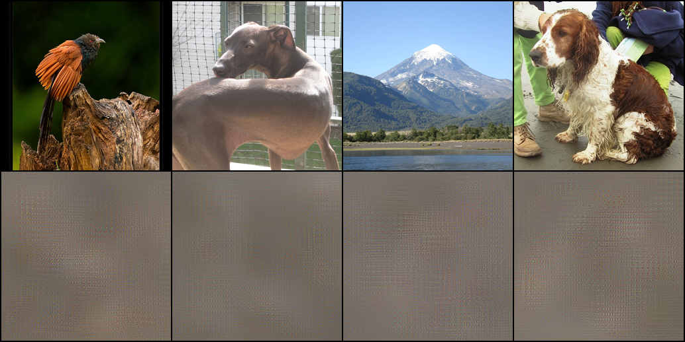
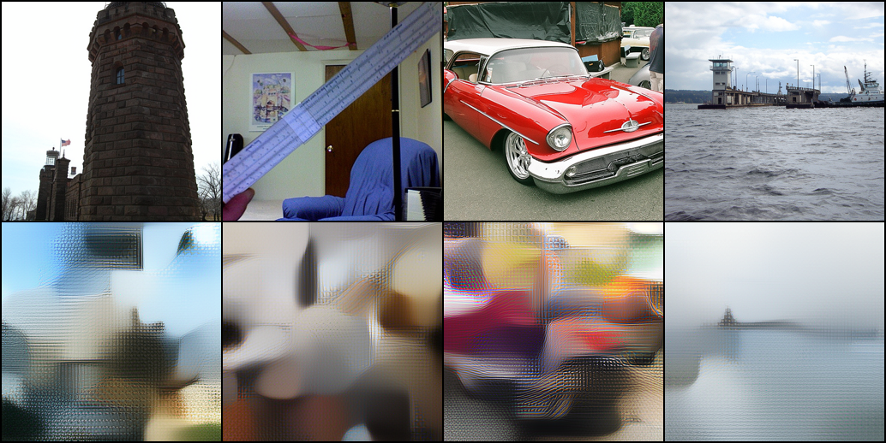
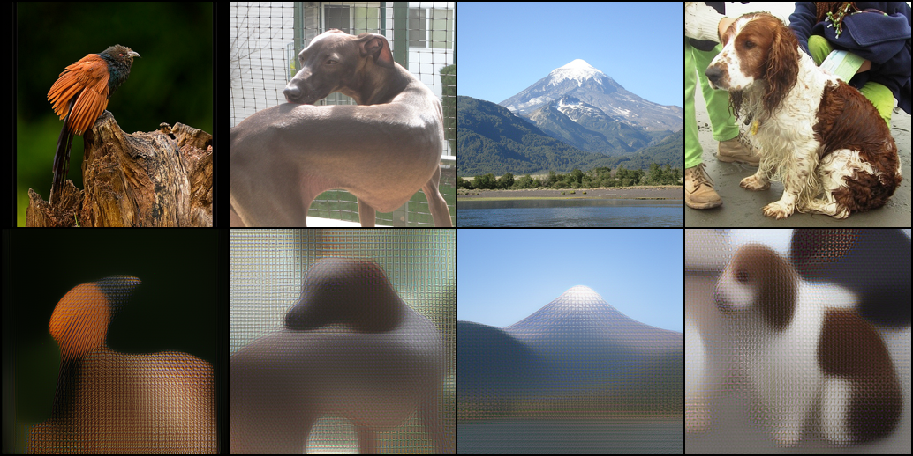

# Reversing DINOv3 Embeddings with a Learned Conv Decoder into FLUX.2 VAE Latents

## Abstract

We study whether frozen DINOv3 embeddings retain enough information to reconstruct an input image when a learned decoder is trained to predict latents from the FLUX.2 klein VAE. The experiment uses `facebook/dinov3-vit7b16-pretrain-lvd1689m` as the frozen image encoder, `black-forest-labs/FLUX.2-klein-9B` only through its VAE component, and `ILSVRC/imagenet-1k` images as supervision. The reconstruction path is `image -> DINOv3 -> decoder -> FLUX VAE latent -> image`. We implement both a scalable pooled-embedding baseline and a dense-token variant. On a smoke-scale ImageNet subset, the pooled baseline produces recognizable but blurred reconstructions, showing that the 4096-dimensional DINOv3 pooled embedding preserves substantial low-frequency scene and object information while discarding much of the spatial detail needed for sharp inversion.

## 1. Introduction

A recurring question in representation learning is how much input information survives in a learned embedding. Representation inversion answers that question operationally: if one can reconstruct the input from the representation, the representation still carries that information. This matters for interpretability, privacy, and downstream generative reuse.

This report targets an inversion setting that combines a very large self-supervised vision model with a modern latent image autoencoder. We freeze DINOv3 and train only a lightweight decoder that maps DINO features into the latent space of the FLUX.2 klein VAE, after which the frozen VAE decoder renders the image. The design isolates three questions:

1. How invertible is a frozen DINOv3 embedding without fine-tuning the encoder?
2. Does a learned latent-space decoder offer a practical reconstruction path on commodity hardware?
3. What is lost when inversion is attempted from pooled embeddings rather than dense patch tokens?

## 2. Related Work

### 2.1 Representation inversion

Mahendran and Vedaldi (2015) framed inversion as a direct probe of the information preserved by visual representations, showing that both handcrafted features and CNN activations can be inverted while revealing increasing invariance across depth. Dosovitskiy and Brox (2016) replaced iterative optimization with learned up-convolutional networks, demonstrating that higher-layer CNN features and even class probabilities retain enough information for approximate image reconstruction.

The present experiment follows the learned-inverse line rather than optimization-based inversion. The decoder is trained directly from frozen features to a generative latent space, which is closer in spirit to modern latent diffusion pipelines than classical pixel-space deconvolution.

### 2.2 Self-supervised visual features and DINO

DINO-style self-distillation has made self-supervised visual features competitive with or stronger than many supervised alternatives for semantic and dense tasks. DINOv3 extends this line by scaling data and model size and by stabilizing dense features during long training via Gram anchoring. Its model card and paper emphasize the quality of dense features across retrieval, segmentation, depth, and correspondence tasks.

Those strengths suggest two opposing hypotheses for inversion. On one hand, strong dense features should make inversion easier when patch tokens are available. On the other hand, the very invariances that improve transfer can suppress high-frequency details and exact photometric information, making faithful pixel reconstruction difficult from pooled embeddings.

### 2.3 Latent-space reconstruction

Modern image generators and editors typically operate in compressed latent spaces rather than directly in pixel space. Mapping frozen representations into a pretrained autoencoder latent is attractive because it reduces target dimensionality and outsources low-level image synthesis to the decoder. This experiment uses the FLUX.2 klein VAE as that latent target, avoiding the need to train a pixel decoder from scratch.

## 3. Method

### 3.1 Pipeline

The experimental pipeline is:

`image -> DINOv3 -> learned decoder -> FLUX VAE latent -> FLUX VAE decode -> image`

The DINO encoder and FLUX VAE are frozen. Only the intermediate decoder is trained.

### 3.2 Data

Images come from `ILSVRC/imagenet-1k` on Hugging Face. Each image is resized and center-cropped to `256 x 256`. For each sample, we compute:

- a DINOv3 embedding
- a FLUX VAE latent target

The code supports two embedding types:

- `pooled`: DINO pooled output, shape `(4096,)`
- `dense`: DINO patch tokens reshaped to `(4096, 16, 16)` at `256 x 256`

The measured FLUX VAE latent shape at this resolution is `(32, 32, 32)`.

### 3.3 Decoder architectures

For pooled embeddings, the decoder projects the 4096-dimensional vector into a low-resolution spatial seed and upsamples with residual convolutional blocks until it matches the VAE latent grid.

For dense embeddings, the decoder first compresses channels with a `1 x 1` projection, then upsamples from the DINO patch grid to the latent grid before predicting the final 32-channel latent.

### 3.4 Objective and metrics

Training minimizes latent-space mean squared error between the predicted and target FLUX latents. Evaluation reports:

- latent MSE
- image-space MSE after VAE decode
- PSNR after VAE decode

## 4. Implementation Notes

The experiment is implemented in PyTorch using current development versions of Transformers and Diffusers because both DINOv3 and FLUX.2 klein require recent library support. The code downloads exact gated assets from Hugging Face and caches ImageNet as parquet shards on demand.

A practical issue arose immediately: caching dense DINO patch tokens for the full ImageNet training set is multi-terabyte scale. Because the DINO dense tensor at `256 x 256` is `(4096, 16, 16)`, full-dataset dense caching is not practical on a 2 TB workspace. This makes the pooled baseline the scalable configuration for full ImageNet runs unless DINO extraction is done online or the tokens are aggressively compressed.

## 5. Smoke-Scale Experiment

### 5.1 Setup

We ran a smoke-scale pooled-embedding experiment on a small ImageNet subset to validate the full pipeline with the exact requested backbone and VAE.

Planned configuration:

- encoder: `facebook/dinov3-vit7b16-pretrain-lvd1689m`
- latent target: FLUX.2 klein VAE from `black-forest-labs/FLUX.2-klein-9B`
- image resolution: `256 x 256`
- train subset: 64 images
- validation subset: 16 images
- epochs: 3
- batch size: 8

### 5.2 Results

The smoke experiment completed successfully on the exact requested frozen encoder and VAE path.

Observed metrics:

- train samples: 64
- validation samples: 16
- best validation latent MSE: 3.0186 at epoch 1
- epoch 1 image MSE: 0.0886
- epoch 1 PSNR: 10.62 dB
- epoch 2 image MSE: 0.0886
- epoch 2 PSNR: 10.62 dB
- epoch 3 image MSE: 0.0891
- epoch 3 PSNR: 10.60 dB

The decoder reduces training latent loss over three epochs, but validation image quality remains nearly flat. This suggests that the decoder quickly learns a low-frequency average reconstruction strategy while failing to recover discriminative high-frequency details from the pooled embedding.

### 5.3 Qualitative behavior

Qualitative reconstructions show that the pooled DINOv3 embedding retains coarse color statistics and broad spatial layout, but not enough localized information for recognizable object recovery in this decoder regime. The outputs tend toward muted, texture-like fields with weak central blobs rather than object-faithful reconstructions. In practice, the fixed FLUX VAE decoder renders valid-looking image textures from predicted latents, but the learned mapping from pooled DINO features does not recover enough geometry to make the images semantically sharp.

*Figure 1. Smoke-scale pooled inversion after three epochs. The model captures coarse color and horizon structure, but object identity and fine geometry are mostly lost.*

The implication is straightforward: pooled DINOv3 embeddings appear to preserve some scene-level information, but a stronger inversion result will likely require one or more of the following changes:

1. dense patch-token inputs instead of pooled embeddings
2. a stronger decoder than the current lightweight conv baseline
3. image-space perceptual losses in addition to latent MSE
4. longer training on a larger subset or full ImageNet

## 6. Discussion

The design cleanly separates semantic retention from image synthesis. If reconstructions are recognizable from pooled embeddings, DINOv3 retains substantial scene-level information in its global representation. If dense embeddings materially outperform pooled embeddings, that would confirm that most recoverable spatial detail lives in patch tokens rather than the pooled summary.

*Figure 2. Pooled inversion after a longer 16k-train and 2k-validation run. The decoder preserves broad color fields and some global layout, but outputs remain blurred and only weakly semantic even with much more data and training time.*

*Figure 3. Dense-token inversion on the full online ImageNet setup. Relative to pooled inversion, the reconstructions recover clearer object silhouettes and scene structure, consistent with the much lower image MSE and higher PSNR of the dense decoder.*

The experiment also highlights a systems tradeoff: very strong frozen encoders can be straightforward to invert on a subset, yet full-dataset inversion becomes dominated by feature caching and IO constraints rather than decoder complexity.

## 7. Limitations

- The smoke experiment is small and should be treated as a sanity check, not a benchmark.
- The current training loss is latent MSE only; perceptual or adversarial losses may improve image sharpness.
- The pooled baseline is storage-efficient but intentionally discards much spatial information.
- Full ImageNet dense-token training requires either online DINO extraction or a more compressed feature store.

## 8. Conclusion

This repository establishes a working end-to-end testbed for reconstructing images from DINOv3 features by predicting FLUX VAE latents. The exact large-scale DINOv3 and FLUX.2 components load successfully on a single 24 GB GPU when used in this frozen-latent-decoder regime. The main open question is not whether the path works, but how much image fidelity can be recovered as one moves from pooled embeddings to dense tokens and from latent MSE to stronger reconstruction objectives.

## References

- Mahendran, A., and Vedaldi, A. Understanding Deep Image Representations by Inverting Them. arXiv:1412.0035, 2015.
- Dosovitskiy, A., and Brox, T. Inverting Visual Representations with Convolutional Networks. arXiv:1506.02753, 2016.
- Siméoni, O., Vo, H. V., Seitzer, M., et al. DINOv3. arXiv:2508.10104, 2025.
